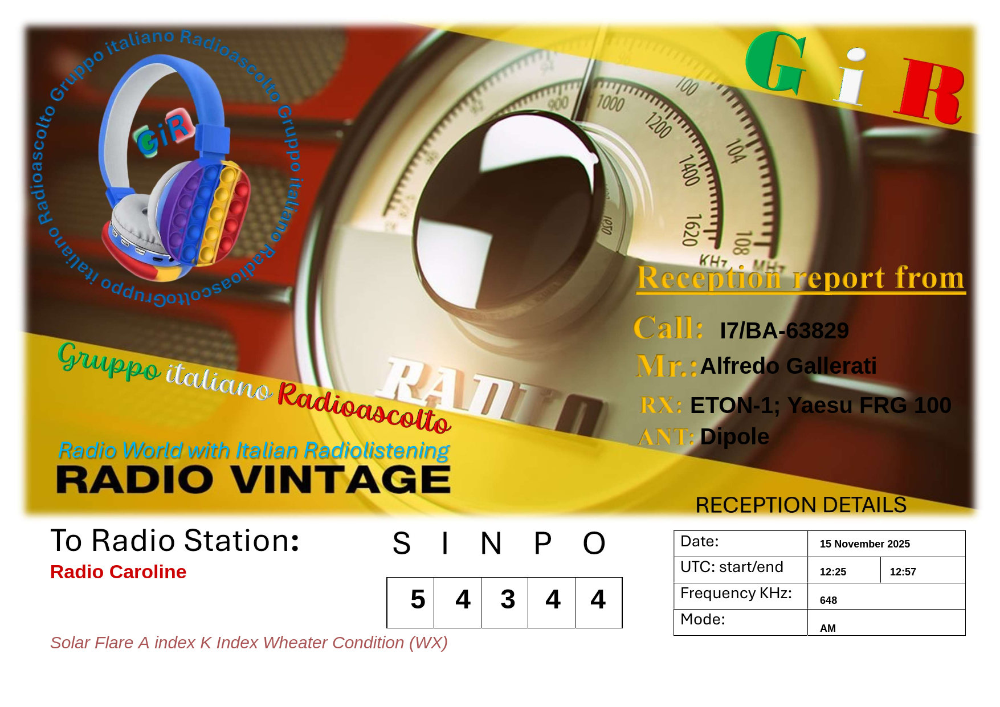

# 📻 RA-GIR Reception Report Generator

**Generatore di eQSL per il Radioascolto Gruppo Italiano (RA-GIR)**

## 🇮🇹 Italiano

Questo progetto è un tool web standalone per generare **Reception Report** (rapporti di ricezione) in formato digitale (eQSL) dedicato agli appassionati di radioascolto del gruppo RA-GIR.

### ✨ Funzionalità

- 📝 **Form intuitivo** per inserire dati della ricezione (Call, SINPO, frequenza, orario, ecc.)
- 🖼️ **Generazione anteprima** in tempo reale con Canvas API
- 💾 **Download PNG** del report generato pronto per essere inviato via email o caricato su piattaforme eQSL
- 📊 **Sistema SINPO** integrato (Segnale, Interferenza, Rumore, Propagazione, Overload)
- 📱 **Responsive design** utilizzabile su desktop e mobile
- 🚀 **Single-page application** - non richiede server o dipendenze esterne

### 🎯 Come usarlo

1. Scarica o clona il repository
2. Apri il file `RA-GIR Reception Report.html` con qualsiasi browser moderno
3. Compila i campi con i dati della ricezione:
   - **Dati Ricevente**: Nominativo, Nome, Ricevitore, Antenna
   - **Dati Stazione**: Nome stazione ricevuta, parametri di propagazione
   - **Dettagli**: Data, ora UTC, Frequenza (kHz), Modo (AM/FM/SSB/CW/DRM)
   - **SINPO**: Valutazione qualità segnale (1-5)
4. Clicca su **"Genera Anteprima"** per visualizzare il risultato
5. Scarica l'immagine con **"Scarica PNG"**

### 🛠️ Tecnologie

- **HTML5** - Struttura semantica
- **CSS3** - Layout responsive con Flexbox/Grid
- **JavaScript Vanilla** - Logica di generazione e manipolazione Canvas
- **Canvas API** - Rendering grafico del report finale
- **Base64** - Template grafico integrato (nessuna dipendenza esterna)

---

## 🇬🇧 English

A standalone web tool for generating **Reception Reports** (eQSL cards) for the Italian Radio Listening Group (RA-GIR). Perfect for SWL (Short Wave Listeners) and radio enthusiasts who want to create digital QSL cards.

### ✨ Features

- 📝 Intuitive form for reception data input (Callsign, SINPO, frequency, UTC time)
- 🖼️ Real-time preview generation using Canvas API
- 💾 PNG download ready for email or eQSL platforms
- 📊 Integrated SINPO reporting system (Signal, Interference, Noise, Propagation, Overload)
- 📱 Responsive design for desktop and mobile
- 🚀 Zero dependencies - works offline

### 🚀 Usage

1. Download/clone the repository
2. Open `RA-GIR Reception Report.html` in any modern browser
3. Fill in the reception details:
   - **Receiver data**: Callsign, Name, Receiver model, Antenna
   - **Station data**: Station name, propagation conditions
   - **Details**: Date, UTC time, Frequency (kHz), Mode
   - **SINPO**: Signal quality rating (1-5)
4. Click **"Genera Anteprima"** (Generate Preview)
5. Download your report with **"Scarica PNG"** (Download PNG)

### 📝 Notes

- The template image is embedded as Base64, making the tool completely portable
- No internet connection required after download
- Compatible with all modern browsers (Chrome, Firefox, Safari, Edge)

### 📄 License

Questo progetto è rilasciato per uso personale e hobbistico nel mondo del radioascolto.
This project is released for personal and hobby use in the radio listening community.
Tutti i diritti sono riservati al "Gruppo Italiano Radioascolto"

---

**73** 📡
---

## 📸 Anteprima / Screenshot

*Esempio di report generato per una ricezione di Radio Caroline su 648 kHz*

---
